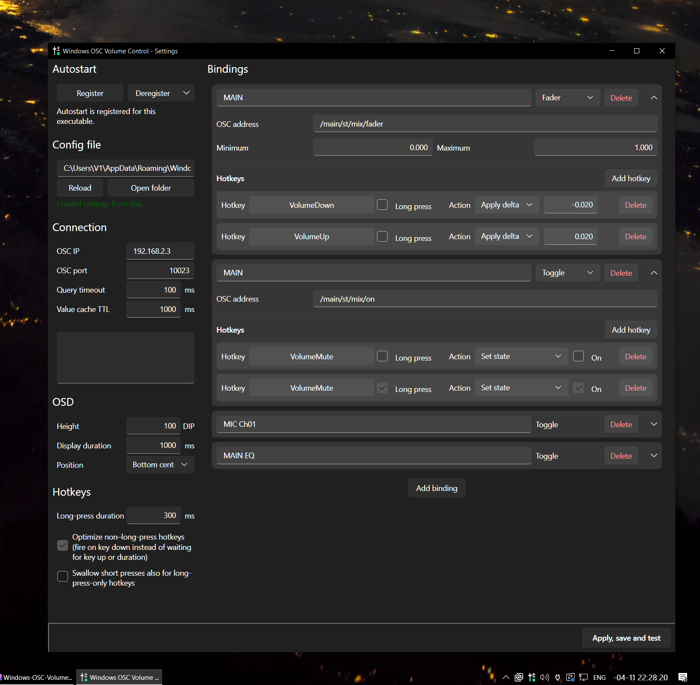

# Windows-OSC-Volume-Control

Windows tray application that captures configurable global hotkeys and maps them to **OSC** mixer actions (tested on X32). It is built for fast desktop control without keeping the mixer UI in focus.

## Features

- **System tray app**: Tray icon with menu (configure, exit) and live status icon state
- **Global hotkeys**: Low-level keyboard hook so configured shortcuts work system-wide, not only when a window is focused
- **OSC bindings**: Settings are an ordered list of bindings.
  Each row has one OSC address, a display name, and hotkey entries.
  Fader and toggle share the same editor pattern; fields and actions depend on the type.
  - **Fader**: float level, clamped between configurable min and max.
  - **Toggle**: bool-style parameter.
- **Hotkeys per binding**: Each hotkey entry pairs a key combination (optionally with Ctrl/Shift/Alt) with one action. Fader actions are **set value** (absolute float) or **apply delta**. Toggle actions are **toggle** (flip) or **set state** (fixed on/off). A binding may define multiple entries; the default configuration uses the media volume keys for MAIN fader deltas and mute for MAIN toggle.
- **Short press and long press**: Each hotkey assignment is either a normal short press or marked **long press** so it runs only after a hold. Hold duration is set in the keyboard section of the settings window. The same key can combine tap vs hold behavior, or be reused on different bindings.
- **On-screen status (OSD)**: Shows pending, level, toggle, and error feedback for hotkey actions. Size, position, and display duration are configurable
- **Connection health feedback**: Startup connection test and runtime failure detection update tray state and surface errors
- **Connection settings**: Configure OSC target IP, port, and query timeout in the settings window, with connectivity checks
- **Optional autostart**: Register/unregister in the configuration window with dynamic current-state feedback
- **Resilient config persistence**: Stores settings in `%APPDATA%` and falls back to defaults for missing/invalid entries

## Typical use cases

- Control mixer faders or knobs from the keyboard: several hotkeys can target the same OSC address with different deltas or absolute levels.
- Control toggles (mutes, talkback, etc.) from multiple keys, or split one key into short-press and long-press actions via separate rows.
- Operate the mixer while other applications have focus.

## Running a Release build

- Install the [.NET 10 Desktop Runtime for Windows (x64)](https://dotnet.microsoft.com/download/dotnet/10.0)
- Releases are shipped as a **zip**: extract it to a folder and run the application from there
- No additional VC++ redistributable is required by this project

## Notes

- Platform: Windows (WPF + Fluent theme + low-level keyboard hook)
- Mixer compatibility: implemented against OSC and tested on Behringer X32; other OSC mixers may work if value semantics match
- OSC library: `src/Osc/SharpOSC` vendor code is based on [ValdemarOrn/SharpOSC](https://github.com/ValdemarOrn/SharpOSC)

## Building

- This project is built with **Visual Studio** (open `Windows-OSC-Volume-Control.slnx`)
- The **.NET 10 SDK** is required: [.NET 10 SDK](https://dotnet.microsoft.com/download/dotnet/10.0)

## Testing

- Unit tests use **xUnit**
- Run them with `dotnet test "tests/WindowsOscVolumeControl.Tests/WindowsOscVolumeControl.Tests.csproj"`
