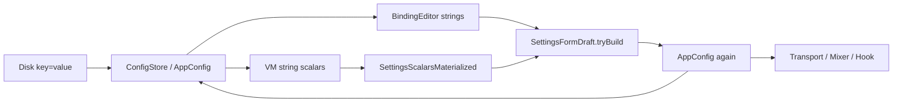

# Audit: wasteful indirection and redundant round-trips

Audit date: 2026-07-07

This is a pragmatic monolith with few interface layers. The real cost is concentrated in the **settings pipeline** and in **unconditional runtime reconfiguration** on apply. Below: findings ranked by impact, with what is intentional and should stay.

Do not commit this file.

---

## Executive summary

| Area | Verdict |
|------|---------|
| Service/interface layering | **Lean** — almost no `I*` abstractions; `AppCoordinator` is the hub by design |
| Settings UI | **Heavy** — 3 representations, dual validation, redundant reload |
| OSC hotkey path | **Mostly sound** — query-then-act when cache is cold is necessary |
| Apply / commit | **Wasteful** — full socket recycle, cache wipe, binding re-clone even when unchanged |

---

## Architecture context

Single **.NET 10 WinExe**: WPF + WinForms tray, no DI container, almost no interfaces. Composition is manual in `AppCoordinator`. There is no separate “service” layer — runtime behavior lives in concrete **controllers/managers** wired directly.

### Layering and data flow

```
┌─────────────────────────────────────────────────────────────┐
│  UI: ConfigWindow + panels + ConfigWindowViewModel          │
│       BindingEditor / ControlActionEditor (edit DTOs)       │
└───────────────┬─────────────────────────────────────────────┘
                │ SettingsFormDraft.tryBuild → AppConfig
                │ AppCoordinator.commitConfigFromSettingsFormAsync
                ▼
┌─────────────────────────────────────────────────────────────┐
│  ConfigStore (in-memory AppConfig + disk persistence)       │
└───────────────┬─────────────────────────────────────────────┘
                │ applyConfigFromStoreAsync
                ▼
┌─────────────────────────────────────────────────────────────┐
│  Runtime: OscTransport, MixerController, BindingManager,    │
│           KeyboardHook, OSDController, TrayController       │
└─────────────────────────────────────────────────────────────┘
```

### Runtime hotkey path

```
KeyboardHook
  → BindingManager.tryGetDispatchTargets(gesture)
  → AppCoordinator.handleOscHotkey(binding, action)
  → MixerController (enqueueContinuousAction / setToggle / toggle)
  → OscTransport (UDP)
  → MixerController.onMessage (reply)
  → eventReceived → AppCoordinator.onMixerEvent
  → OSDController (ShowLevel / ShowToggle / ShowError)
```

### Config save/apply path (“Apply, Save & Test”)

```
ConfigWindow (code-behind)
  → VM scalar Result<T> validation + formatBindingErrorsForFooter()
  → SettingsFormDraft.tryBuild(scalars, osd, hotkey flags, bindings)
  → AppConfig
  → AppCoordinator.commitConfigFromSettingsFormAsync()
      → ConfigStore.adoptAppConfig()
      → applyConfigFromStoreAsync()  (transport, tray endpoint, mixer, osd, hotkeys)
      → ConfigStore.tryPersistToDisk()
  → ConfigWindow runs latency probes via MixerController + NetworkPingTest
```

### Central hubs

| File | Role |
|------|------|
| `src/App/AppCoordinator.cs` | Composition root; cross-cutting wiring |
| `src/Config/ConfigStore.cs` | Persistence + parsing monolith |
| `src/UI/Config/ViewModels/ConfigWindowViewModel.cs` | Settings VM; scalars, bindings, validation |
| `src/UI/Config/ConfigWindowModels.cs` | `BindingEditor`, `ControlActionEditor`, custom MVVM primitives |
| `src/UI/Config/ConfigWindow.xaml.cs` | Apply orchestration, latency testing |
| `src/UI/Config/SettingsFormDraft.cs` | Second validation/build gate between editors and `AppConfig` |
| `src/Binding/BindingManager.cs` | Runtime index + `Config` defaults/parsers |

---

## High impact — redundant round-trips at runtime

### 1. OSC socket torn down on every apply (even if IP/port unchanged)

`commitConfigFromSettingsFormAsync` always calls `applyConfigFromStoreAsync`, which always awaits `_transport.applyConfigAsync`. That method **always** cancels the receive loop, disposes the UDP client, and creates a new one — no endpoint equality check.

Location: `src/Osc/OscTransport.cs` — `applyConfigAsync`

```csharp
oldCts?.Cancel();
wakeReceiveLoop(oldUdp);
await waitForReceiveLoopAsync(oldLoop).ConfigureAwait(false);
oldCts?.Dispose();
oldUdp?.Dispose();
(UdpClient nextUdp, bool boundToConfiguredPort) = createUdpClient(nextConfig.endPoint.Port);
```

**Cost:** unnecessary network churn, receive-loop restart, and brief loss of in-flight replies when the user only changes OSD height, bindings, or hotkey timing.

**Fix direction:** compare `endPoint` (and maybe bind policy); no-op or lightweight update when unchanged.

---

### 2. Mixer address cache cleared on any mixer config change

Location: `src/Mixer/MixerController.cs` — `ApplyConfig`

```csharp
_config = new Config(config);
_stateByAddress.Clear();
_pendingInfoVersion++;
```

Any apply wipes **all** per-address caches and cancels pending `/info`, even if only `timeoutMs` or `ValueCacheTtlMs` changed and bindings/endpoints did not.

**Cost:** next hotkey on a delta binding forces a fresh OSC query round-trip that was avoidable.

**Fix direction:** selective invalidation (e.g. only when TTL semantics require it, or never clear on timeout-only changes).

---

### 3. Binding objects cloned twice on every commit

Flow on apply:

1. `SettingsFormDraft.tryBuild` → new `BindingLinear` / `BindingToggle` / … instances
2. `ConfigStore.adoptAppConfig` → `new AppConfig(fromForm)` → `BindingManager.Config` clones every binding again
3. `rebuildFromConfig` → `cloneBinding(b)` for every row again

Location: `src/Binding/BindingManager.cs` — `rebuildFromConfig`

```csharp
foreach (BindingAbstract b in bindings) {
    BindingAbstract row = cloneBinding(b);
```

**Cost:** CPU and allocations proportional to binding count × actions on every apply, with no equality short-circuit.

**Fix direction:** adopt by reference when the draft already owns fresh objects, or compare serialized/hash snapshot before rebuild.

---

### 4. Hotkey hook reset on every config apply

`rebuildHotkeysFromConfig` always calls `_hook.applyConfig`, which **always** `cancelAllActivePressesLocked()`.

Location: `src/Input/KeyboardHook.cs` — `applyConfig`

```csharp
cancelAllActivePressesLocked();
Config c = Config.Clamped(config);
_longPressDurationMs = ...
```

This runs even when only OSC bindings changed and keyboard settings are identical.

**Cost:** in-flight long-press gestures aborted unnecessarily.

---

### 5. Dual OSC query mechanisms in `MixerController`

Runtime path: `refreshCacheAsync` → bare `trySendAsync` → reply via shared `onMessage`.

Settings/latency path: `QueryContinuousWireAsync` / `QueryToggleAsync` attach a **one-shot** `messageReceived` handler per call.

Location: `src/Mixer/MixerController.cs` — `QueryContinuousWireAsync`

```csharp
_transport.messageReceived += handler;
try {
    if (!await trySendAsync(address).ConfigureAwait(false))
        return null;
    OscMessage message = await reply.Task.WaitAsync(getTimeout()).ConfigureAwait(false);
```

**Cost:** two subscription models for the same UDP stream; harder to reason about and slightly more overhead under concurrent probes (apply runs 10 parallel ping+OSC loops).

**Fix direction:** route ad-hoc queries through the same pending-reply machinery as `onMessage` (or a single internal awaitable query API).

---

## High impact — settings UI round-trips

### 6. Config window loads store twice on open — **done**

`ConfigWindowViewModel` constructor called `loadFromConfigStore()`. `ConfigWindow` constructor then called `loadFromConfigStore()` again via its own wrapper.

**Fix applied:** removed the VM ctor call; initial load stays in `ConfigWindow.loadFromConfigStore()` (VM load + `refreshStatusBar()`).

---

### 7. `fromBinding` triggers validation on every property set — **done**

`fromBinding` assigns via properties (`ed.name = f.name`, etc.). Each setter called `recomputeValidation()`, which re-parsed all fields. The ctor also called `recomputeValidation()` once.

With *N* bindings and *M* fields, load cost was **O(N × M × parsers)** with no batching (unlike scalars, which use `_loadingScalars`).

**Fix applied:** property setters validate only the edited field (`validateName`, `validateMinimumField`, etc.). Min/max and range pairs re-parse one side and refresh cross-field errors from cached parse results on the other; ordering conflicts mark both fields invalid. `recomputeValidation()` remains for type changes and deleted state.

---

### 8. Dual validation gate on apply (parse everything twice) — **done**

Apply click path in `ConfigWindow`:

1. `vm.scalarsResult.match(...)` — scalar check
2. `vm.formatBindingErrorsForFooter()` — read live `INotifyDataErrorInfo` errors
3. `SettingsFormDraft.tryBuild(...)` — parse all fields again into new domain objects

- **Live:** `BindingEditor` / `ControlActionEditor` maintain `INotifyDataErrorInfo` via `recomputeValidation()` on each edit.
- **Apply:** `formatBindingErrorsForFooter()` reads those errors, then `SettingsFormDraft.tryBuild()` **parses all fields again** into new domain objects.

If the two paths stay in sync, step 2 is redundant whenever step 3 runs. If they diverge, you have a correctness bug rather than a feature.

**Fix applied:** apply trusts live validation. `BindingEditor.tryBuildMaterialized()` and `ControlActionEditor.tryBuildMaterialized()` assemble domain objects from cached parse results (`_nameResult`, `_minimumResult`, `_floatValueResult`, etc.). Hotkey and action-type compatibility are validated live and included in the footer error pass. `SettingsFormDraft.tryBuild()` delegates to those materialized builders instead of re-parsing text fields.

---

### 9. Triple config representation



Scalars: typed `AppConfig` → `ToString()` for TextBoxes → parse on keystroke → `SettingsScalarsMaterialized` on apply.

Bindings: `BindingAbstract` → string editors → `BindingAbstract` again.

The string layer is justified for WPF text binding; the **editor DTO layer** plus **draft builder** is the main indirection. A single editable `AppConfig` (or binding graph) with adapters for display formatting would remove one full conversion hop.

---

## Medium impact — architectural indirection

### 10. Split orchestration: `ConfigWindow` vs `ConfigWindowViewModel`

The window holds `_mixer`, `_trayController`, `_appCoordinator`, `_configStore` while the VM also holds `_appCoordinator` and `_configStore`. Apply, latency probes, and diagnostics sync live in code-behind; validation and collections live in the VM.

**Cost:** duplicated dependencies, harder to trace one apply flow, no performance win.

---

### 11. `BindingManager` mixes runtime index and config parsing

`BindingManager.Config` hosts defaults, disk-oriented parsers, and binding lists. Editors, `SettingsFormDraft`, and `ConfigStore` all depend on it for parsing. The name suggests runtime-only; the type is a **config + parse hub**.

Not a round-trip, but it spreads “where config lives” across `ConfigStore`, `BindingManager.Config`, subsystem `Config` classes, and UI editors.

---

### 12. Custom `ObservableObject` / `ObservableValidationObject` (~120 lines)

Project references **CommunityToolkit.Mvvm** but only uses `RelayCommand`. Custom validation primitives duplicate toolkit `ObservableValidator` behavior.

**Cost:** maintenance and inconsistency (VM uses toolkit patterns partially; editors use custom base).

---

### 13. Diagnostics string formatted multiple times per status change

`onVisibleStatusErrorsChanged` formats the summary once, but `visibleDiagnosticsSummaryForConfigUi()` reformats on demand after apply, and `syncStatusUi` formats again at startup. Cheap at this scale, but the same `formatVisibleStatusErrors(getVisibleStatusErrorTypes())` pattern appears in four places in `AppCoordinator`.

---

### 14. Duplicated utilities — **done**

- ~~`parseKeyValueLines` — `ConfigStore.cs` and `X32Catalog.cs`~~ → shared `ConfigParseUtil.parseKeyValueLines`
- `isBindingBlank` — `SettingsFormDraft.cs` and `ConfigWindowViewModel.cs` (both use `BindingEditor.isBlank`; no separate helper to dedupe)

---

## Low impact / intentional (do not “fix” blindly)

| Pattern | Why it’s OK |
|---------|-------------|
| `AppCoordinator` as composition root | Appropriate for a tray app; no fake service interfaces |
| `StatusController` + `IStatusRegister` | Small, purposeful merge of subsystem errors |
| `OscTransport` under `MixerController` | Real transport vs domain split |
| Shared `parse*` on subsystem `Config` types | DRY between disk, VM, and draft |
| Cold-cache hotkey: query → apply → send | Required OSC semantics for delta actions |
| Apply latency test (10 ping + OSC probes) | User-triggered; intentional |
| `AppConfig` aggregate of nested DTOs | Clear snapshot for store and runtime |

---

## Recommended priorities

1. **Quick wins:** add `_loadingFromConfig` to batch binding validation; collapse apply validation to a single path.
2. **Runtime apply:** endpoint no-op in `OscTransport.applyConfigAsync`; avoid full mixer cache clear when config delta is narrow; skip `rebuildFromConfig` / hook reset when binding snapshot unchanged.
3. **Structural (larger):** reduce settings stack from 3 representations to 2 (editable domain + display adapters), or commit to “strings in UI, parse once on apply” and drop live `INotifyDataErrorInfo` on bindings.

---

## What this audit did not find

- No excessive interface/factory layering in the OSC hotkey path.
- No repeated disk read/write loops (load once at startup; persist once per successful apply).
- No gratuitous `async`/`await` chains in the hotkey dispatch path (`KeyboardHook` → `BindingManager` → `MixerController` is direct).
